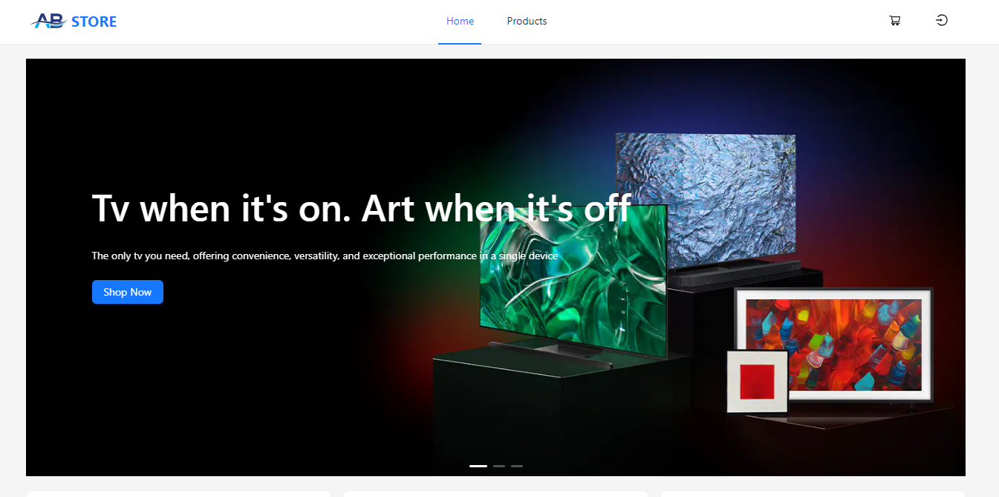
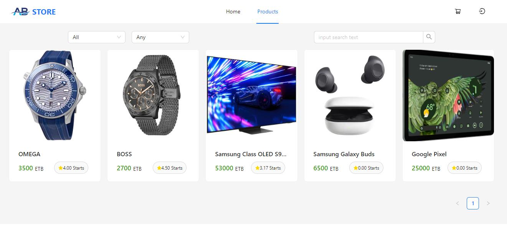

# 🛍️ AB-STORE USER (Frontend)

**AB-STORE USER** is the frontend interface of a modern e-commerce platform that allows users to browse, shop, and securely purchase products online. Built with performance, accessibility, and responsiveness in mind.

## 🚀 Features

- 🔍 Product listing with category filters
- 🛒 Add to cart and manage cart items
- 💳 Checkout UI and payment integration (frontend only)
- 🧾 Order summary and purchase confirmation
- 📱 Fully responsive design
- 🌐 Global state management with Zustand
- 🎨 Clean and modern UI using Ant Design and Tailwind CSS

## 🛠️ Tech Stack

- **Framework**: React (with TypeScript)
- **Styling**: Tailwind CSS, Ant Design (antd)
- **State Management**: Zustand
- **API Integration**: RESTful APIs (backend handled separately)
- **Package Manager**: npm

## 📸 Screenshots

### 🏠 Home Page



---

### 📦 Products



---

## 📦 Getting Started

To run the **user interface locally**:

```bash
# Clone only the frontend repository
git clone https://github.com/birhanu-dejen/ABStore-user.git

# Navigate into the project directory
cd ABStore-user

# Install dependencies
npm install

# Start the development server
npm run dev
```
